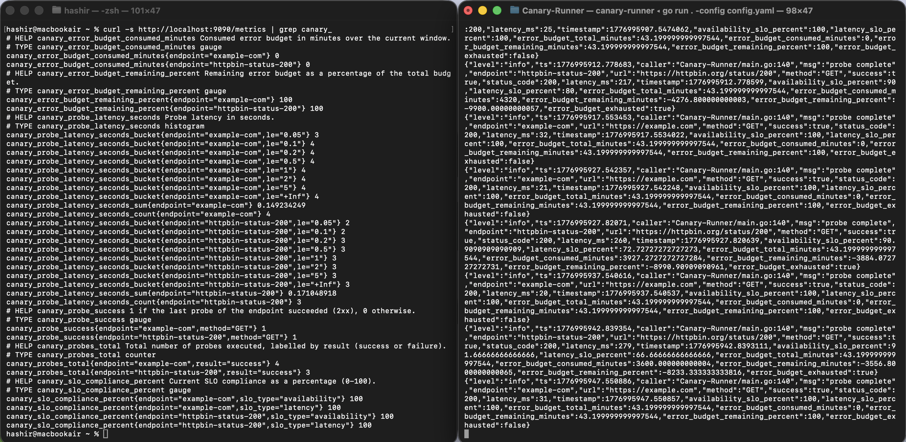

# Canary Runner

A production-quality synthetic HTTP monitoring service in Go.

Canary Runner probes a configurable set of HTTP endpoints on a schedule,
tracks SLO compliance and error budget consumption over a rolling window,
exports Prometheus metrics, and emits structured JSON alerts when one of
four well-defined thresholds is crossed.

It is designed to be operated like an SRE tool, not a hobby script:
- Deterministic configuration with explicit defaults
- Edge-triggered alerts (one alert per crossing — not pager spam)
- Clean stream separation: structured logs on stderr, alerts on stdout
- Graceful shutdown on SIGINT / SIGTERM
- Race-detector-clean test suite with deterministic clocks

---

## Table of Contents

1. [Quick start](#quick-start)
2. [Demo](#demo)
3. [Architecture](#architecture)
4. [SLOs and error budgets explained](#slos-and-error-budgets-explained)
5. [Configuration reference](#configuration-reference)
6. [Metrics reference](#metrics-reference)
7. [Alerts](#alerts)
8. [Running with Prometheus and Grafana](#running-with-prometheus-and-grafana)
9. [Development](#development)

---

## Quick start

### With Docker

```bash
# Build the image (uses the multi-stage Dockerfile, ~15 MB final image)
docker build -t canary-runner:latest .

# Run with the bundled example config; override with -v for your own.
docker run --rm -p 9090:9090 canary-runner:latest

# In another terminal:
curl -s http://localhost:9090/health
curl -s http://localhost:9090/metrics | head -20
```

To use your own config, bind-mount it over the bundled one:

```bash
docker run --rm -p 9090:9090 \
  -v $(pwd)/my-config.yaml:/app/config.yaml \
  canary-runner:latest
```

### From source

```bash
go build -o canary-runner ./
./canary-runner -config config.yaml -metrics-addr :9090
```

Flags:

| Flag             | Default              | Purpose                                    |
|------------------|----------------------|--------------------------------------------|
| `-config`        | `config.yaml`        | Path to the YAML config file               |
| `-metrics-addr`  | `:9090`              | Address for the `/metrics` and `/health` server |

---

## Demo

A live snapshot of Canary Runner monitoring two real targets
(`example.com` and `httpbin.org/status/200`):



- **Left pane** — the output of `curl -s http://localhost:9090/metrics | grep canary_`,
  showing every metric family the exporter publishes: probe success
  gauges, latency histograms, SLO compliance, error budget consumed /
  remaining, and the cumulative probes counter.
- **Right pane** — the running binary's stderr stream, one
  zap-formatted JSON line per probe. Each line carries the full picture
  for that probe: HTTP status, latency, the rolling availability and
  latency SLO percents, total / consumed / remaining error-budget
  minutes, and the boolean `error_budget_exhausted` flag. Notice
  `httpbin-status-200` with `availability_slo_percent: 90` and
  `error_budget_exhausted: true` — that's a real failure mode visible
  end-to-end without any external observability stack wired up.

---

## Architecture

```
                  ┌──────────────┐
                  │  config.yaml │
                  └──────┬───────┘
                         │ (loaded once at startup)
                         ▼
          ┌──────────────────────────────┐
          │       probe.Scheduler        │
          │  (one goroutine per target)  │
          └──────┬───────────────────────┘
                 │ probe.Result
                 ▼
       ┌─────────────────────────┐
       │   main.go probe loop    │──────────────┐
       └────┬───────┬────────────┘              │
            │       │                           │
            ▼       ▼                           ▼
     ┌──────────┐  ┌──────────┐         ┌─────────────────┐
     │   slo.   │  │ budget.  │         │ metrics.        │
     │Calculator│  │  Tracker │         │ Exporter        │
     │ (rolling │  │ (timed   │         │ (Prometheus)    │
     │  window) │  │  state)  │         └────────┬────────┘
     └────┬─────┘  └────┬─────┘                  │
          │             │                        ▼
          │             │              ┌──────────────────┐
          │             │              │ HTTP :9090       │
          │             │              │ /metrics /health │
          │             │              └──────────────────┘
          │             │
          ▼             ▼
       ┌───────────────────────┐         ┌───────────────┐
       │   alerter.Alerter     │────────▶│  stdout       │
       │ (edge-triggered, 4    │  JSON   │  (one line    │
       │  thresholds)          │  lines  │   per alert)  │
       └───────────────────────┘         └───────────────┘

       (zap structured logs go to stderr — separate stream)
```

Each internal package has a single, narrow purpose:

| Package                     | Responsibility                                        |
|-----------------------------|-------------------------------------------------------|
| `internal/config`           | Load + validate YAML, apply defaults                  |
| `internal/probe`            | HTTP probe + per-target scheduling goroutines         |
| `internal/slo`              | Rolling-window availability and latency compliance    |
| `internal/budget`           | Error budget total / consumed / remaining             |
| `internal/metrics`          | Prometheus collectors + `/metrics` and `/health` HTTP |
| `internal/alerter`          | Edge-triggered alert emission as JSON lines           |

---

## SLOs and error budgets explained

If you already know what an SLO is, skip this section.

### Availability SLO

> *"99.9% of probes against this endpoint should succeed."*

A probe **succeeds** when the HTTP request completes with no transport
error and the response status code is `< 500`. Anything else (timeout,
connection refused, 5xx) counts as a failure.

Canary Runner reports compliance over a **rolling window** (default: 30
days). If the window contains 1000 probes and 3 failed:

```
availability_compliance = (1000 - 3) / 1000 = 99.7%
```

### Latency SLO

> *"95% of probes should complete in under 200ms."*

A probe **meets latency SLO** when it succeeded *and* its end-to-end
latency was less than `latency_target_ms`. The compliance value is the
percentage of probes in the window that meet that condition.

### Error budget

The error budget is the fraction of the window you are *allowed* to be
unavailable while still hitting your SLO. With a 99.9% target and a
30-day window:

```
total_budget_minutes  = (100 - 99.9) / 100 × (30 × 24 × 60) = 43.2 minutes
consumed_minutes      = (100 - current_availability) / 100 × window_minutes
remaining_minutes     = total_budget_minutes - consumed_minutes
remaining_percent     = remaining_minutes / total_budget_minutes × 100
```

When `remaining_minutes <= 0` the budget is **exhausted**: any further
unavailability is a SLO violation.

`remaining_minutes` is allowed to go negative — it's deliberately *not*
clamped to zero. A "−400 minute" budget is a much louder operational
signal than a flat zero, and the alerter uses that distinction.

---

## Configuration reference

```yaml
targets:
  - name: "checkout"               # required, must be unique
    url: "https://example.com/api" # required
    method: "GET"                  # default: GET
    timeout_seconds: 5             # default: 5
    interval_seconds: 60           # default: 60
    slo:
      availability_target_percent: 99.9   # default: 99.9
      latency_target_ms: 200              # default: 200
      latency_slo_percent: 95.0           # default: 95.0 (informational only — not yet alerted on)
      window_days: 30                     # default: 30
```

| Field                                 | Required | Default | Notes                                                    |
|---------------------------------------|----------|---------|----------------------------------------------------------|
| `targets[].name`                      | yes      | —       | Used as the metric `endpoint` label; must be unique      |
| `targets[].url`                       | yes      | —       | Full URL including scheme                                |
| `targets[].method`                    | no       | `GET`   | Any HTTP method                                          |
| `targets[].timeout_seconds`           | no       | `5`     | Per-request timeout                                      |
| `targets[].interval_seconds`          | no       | `60`    | Time between probes for this target                      |
| `targets[].slo.availability_target_percent` | no | `99.9`  | Must be in `(0, 100]`                                    |
| `targets[].slo.latency_target_ms`     | no       | `200`   | A probe meets latency SLO if `latency < this`            |
| `targets[].slo.latency_slo_percent`   | no       | `95.0`  | Must be in `(0, 100]`                                    |
| `targets[].slo.window_days`           | no       | `30`    | Rolling window length for compliance and budget          |

Validation runs at startup; any bad config causes a fatal log and exit
non-zero — the process never starts in an unsafe state.

---

## Metrics reference

All metrics are exported on `GET /metrics` in Prometheus text format.

| Metric                                       | Type      | Labels                          | Meaning                                                |
|----------------------------------------------|-----------|---------------------------------|--------------------------------------------------------|
| `canary_probe_success`                       | gauge     | `endpoint`, `method`            | `1` if the most recent probe succeeded, else `0`        |
| `canary_probe_latency_seconds`               | histogram | `endpoint`                      | End-to-end probe latency in seconds                    |
| `canary_slo_compliance_percent`              | gauge     | `endpoint`, `slo_type`          | Rolling-window SLO compliance; `slo_type` is `availability` or `latency` |
| `canary_error_budget_remaining_percent`      | gauge     | `endpoint`                      | % of error budget still available; can go negative      |
| `canary_error_budget_consumed_minutes`       | gauge     | `endpoint`                      | Cumulative consumed budget in minutes                   |
| `canary_probes_total`                        | counter   | `endpoint`, `result`            | Total probes; `result` is `success` or `failure`        |

Histogram buckets (seconds): `0.05, 0.1, 0.2, 0.5, 1.0, 2.0, 5.0`.

### `/health`

`GET /health` returns:

```json
{
  "status": "healthy",
  "uptime_seconds": 3742,
  "targets_monitored": 2
}
```

The metrics registry is *private* to the exporter — it does not pick up
process-level Go runtime collectors, so the scrape only contains
canary-specific signals.

---

## Alerts

Canary Runner emits one JSON line per fired alert to **stdout**. Each
alert is **edge-triggered**: it fires once when the endpoint enters the
alerting region and does not re-fire while it stays there. When the
endpoint recovers and later re-enters the region, a fresh alert fires.

There are four alert types:

| Alert type                | Level    | Fires when                                            |
|---------------------------|----------|-------------------------------------------------------|
| `error_budget_warning`    | WARNING  | `error_budget_remaining_percent < 50`                |
| `error_budget_critical`   | CRITICAL | `error_budget_remaining_percent < 10`                |
| `error_budget_exhausted`  | CRITICAL | Error budget fully consumed (`remaining_minutes <= 0`)|
| `consecutive_failures`    | CRITICAL | 5 probes in a row failed for the same endpoint        |

A success resets the consecutive-failures counter; recovery above the
budget threshold clears the corresponding sticky flag.

### Example alert payloads

**Warning** — first crossing below 50%:

```json
{
  "level": "WARNING",
  "timestamp": "2026-04-23T10:14:32Z",
  "alert": "error_budget_warning",
  "endpoint": "checkout",
  "url": "https://example.com/api",
  "slo_compliance_percent": 99.42,
  "error_budget_remaining_percent": 48.2,
  "error_budget_remaining_minutes": 20.83,
  "consecutive_failures": 0,
  "message": "error budget below 50% remaining"
}
```

**Critical** — budget down to single digits:

```json
{
  "level": "CRITICAL",
  "timestamp": "2026-04-23T11:02:18Z",
  "alert": "error_budget_critical",
  "endpoint": "checkout",
  "url": "https://example.com/api",
  "slo_compliance_percent": 99.91,
  "error_budget_remaining_percent": 8.1,
  "error_budget_remaining_minutes": 3.5,
  "consecutive_failures": 0,
  "message": "error budget below 10% remaining"
}
```

**Exhausted** — budget fully spent:

```json
{
  "level": "CRITICAL",
  "timestamp": "2026-04-23T12:30:00Z",
  "alert": "error_budget_exhausted",
  "endpoint": "checkout",
  "url": "https://example.com/api",
  "slo_compliance_percent": 99.89,
  "error_budget_remaining_percent": -1.4,
  "error_budget_remaining_minutes": -0.6,
  "consecutive_failures": 0,
  "message": "error budget fully consumed"
}
```

**Consecutive failures** — five in a row:

```json
{
  "level": "CRITICAL",
  "timestamp": "2026-04-23T12:35:42Z",
  "alert": "consecutive_failures",
  "endpoint": "checkout",
  "url": "https://example.com/api",
  "slo_compliance_percent": 99.42,
  "error_budget_remaining_percent": 48.2,
  "error_budget_remaining_minutes": 20.83,
  "consecutive_failures": 5,
  "message": "5 consecutive probe failures"
}
```

### Wiring alerts into a pager

Because alerts are line-delimited JSON, any log shipper can pick them up:

```bash
# Filebeat / Vector / Promtail: tail stdout, filter level=CRITICAL,
# forward to PagerDuty / Slack / Opsgenie. Example with jq:
canary-runner -config config.yaml \
  | jq -c 'select(.level == "CRITICAL")' \
  | curl -X POST https://events.pagerduty.com/...
```

---

## Running with Prometheus and Grafana

Add Canary Runner as a scrape target in `prometheus.yml`:

```yaml
scrape_configs:
  - job_name: canary-runner
    scrape_interval: 15s
    static_configs:
      - targets: ['canary-runner:9090']
```

### Useful PromQL

```promql
# Current availability per endpoint
canary_slo_compliance_percent{slo_type="availability"}

# Error budget remaining (sorted, ascending — worst first)
sort(canary_error_budget_remaining_percent)

# Probe failure rate over the last 5 minutes
rate(canary_probes_total{result="failure"}[5m])

# 95th percentile latency per endpoint
histogram_quantile(0.95, sum by (endpoint, le) (rate(canary_probe_latency_seconds_bucket[5m])))

# Endpoints where the budget is going to run out within an hour at the current burn rate
predict_linear(canary_error_budget_remaining_minutes[1h], 3600) <= 0
```

### Grafana panel suggestions

- **Stat**: `min(canary_error_budget_remaining_percent)` — single-pane "worst endpoint right now"
- **Time series**: `canary_slo_compliance_percent{slo_type="availability"}` over 24h, grouped by `endpoint`
- **Heatmap**: `canary_probe_latency_seconds_bucket` for latency distribution
- **Table**: `canary_probes_total` joined by endpoint, with success/failure as columns

---

## Development

Requires Go 1.26+ (matches the toolchain pinned in `go.mod`).

```bash
# Run all tests with the race detector — this is the gate for every change
go test ./... -race

# Build the binary
go build -o canary-runner ./

# Run against the example config
./canary-runner -config config.yaml
```

### Layout

```
.
├── main.go                  # process entry: wires every package together
├── config.yaml              # example configuration
├── Dockerfile               # multi-stage build → distroless static image
├── go.mod / go.sum
└── internal/
    ├── alerter/             # edge-triggered JSON alerting
    ├── budget/              # error budget arithmetic
    ├── config/              # YAML loader + defaults + validation
    ├── metrics/             # Prometheus exporter + /health
    ├── probe/               # HTTP prober + scheduler
    └── slo/                 # rolling-window compliance calculator
```

Every package that depends on time accepts a `Clock` interface
(production `RealClock`, tests use a `fakeClock`). This keeps the test
suite deterministic and free of `time.Sleep`-based flakes.
